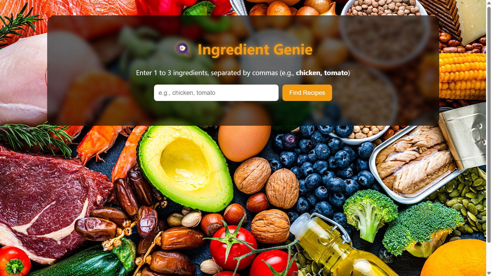
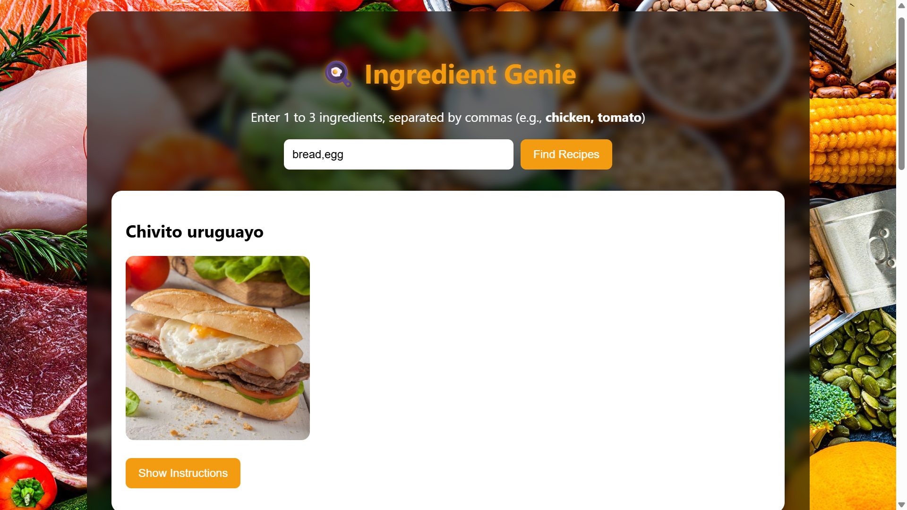
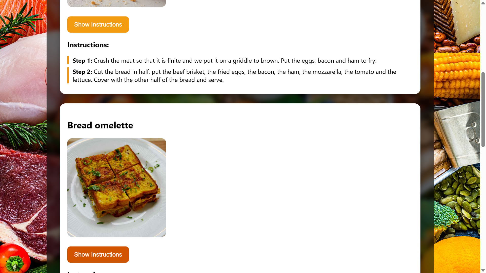

# 🍳 Ingredient Genie

Ingredient Genie is a responsive web application that helps users discover delicious recipes based on the ingredients they have. Users can enter up to three ingredients, and the application fetches matching recipes using the MealDB API. If no matching recipes are found, it suggests popular vegetarian recipes as an alternative.

---

##  Features

- Search recipes using 1–3 ingredients
- Displays recipe names and images
- View step-by-step cooking instructions
- Responsive and user-friendly interface
- Automatic fallback to vegetarian recipes when no exact matches are found
- Real-time data fetched from the MealDB API

---

## Tech Stack

- **HTML5**
- **CSS3**
- **JavaScript (ES6)**
- **MealDB API**

---

## Project Structure

Ingredient-Genie/
│── index.html
│── w.jpg
│── README.md
---

## How to Run

1. Clone the repository:

```bash
git clone https://github.com/your-username/Ingredient-Genie.git
```

2. Open the project folder.

3. Double-click `index.html` or open it in any modern web browser.

No installation or server setup is required.

---

##  Screenshots

### Home Page


### Recipe Results


### Cooking Instructions

## API Used

This project uses the MealDB API to fetch recipe information.

https://www.themealdb.com/api.php

---

## Future Enhancements

- Filter recipes by cuisine or category
- Display nutritional information
- Save favorite recipes
- Dark/Light mode
- Voice-based ingredient search
- Search history

---

## Author

Harshini

GitHub: https://github.com/your-HarshiniGollapelly

---

## License

This project is licensed under the MIT License.
